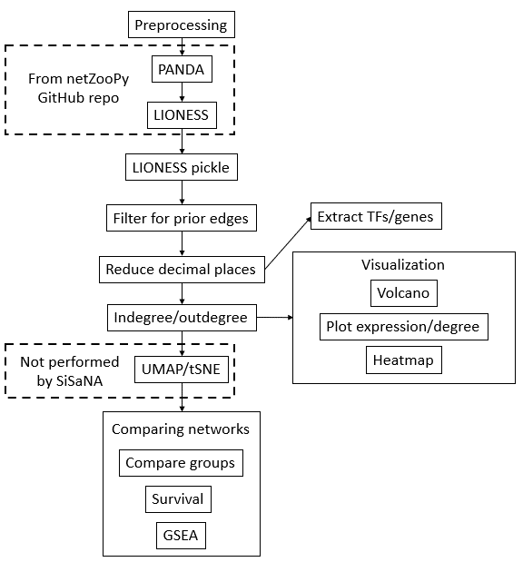

# SiSaNA
Single Sample Network Analysis

SiSaNA is used both before and after creating both PANDA and LIONESS networks from the package netZooPy. SiSaNA first needs to pre-process the data to be ran in PANDA/LIONESS. SiSaNA takes the LIONESS output, processes it to be analyzed downstream, and then calculates in- and out-degree for each of the reconstructed networks. Additionally, it can compare the expression/degree between groups of interest, including performing statistical tests, visualizing the results (volcano plots, boxplots, and violin plots), and compare the survival between groups.

**Note: The steps below are for the basic use of SiSaNA. There are other functionalities across different scripts that are not covered in this file.**

## Requirements
 - python v3.12.0 (see installation steps for creating a conda environment with this specific Python version)
 - A cloned repo of netZooPy (https://github.com/netZoo/netZooPy/tree/master)
   
## Installation can be performed by running the following steps

1. Create a conda virtual environment with python 3.12.0
```
conda create --prefix /path/to/env-name python=3.12.0
```

2. Enter the conda environment
```
conda activate /path/to/env-name
```

3. Clone this repo
```
git clone https://github.com/newmanno/sisana.git
```

4. Move into the repo directory, then run the following command to install the required modules
```
cd sisana
pip3 install -r requirements.txt
```

## Pipeline overview


## Pre-processing of data
This step is actually performed prior to running PANDA/LIONESS, and it filters the expression matrix, PPI file, and prior motif to contain the same genes/TFs, which is necessary for running PANDA/LIONESS.

#### Example command
```
python preprocess.py -e expression_file.tsv -m motif_file.txt -p ppi_file.txt -n 10 -o ./output/
```

#### Inputs
 - `-e`: Path to file containing the gene expression data. Row names must be genes, the expression file does not have a header, and the cells are separated by a tab
 - `-m`: Path to motif file, which gets filtered to only contain genes that pass the minimum number of samples threshold
 - `-p`: Path to ppi file, which gets filtered to only contain genes that pass the minimum number of samples threshold
 - `-n`: Minimum number of samples a gene must be expressed in; expression data will be filtered for only genes that pass
 - `-o`: Path to output directory

#### Outputs
Three files, one for each of the three filtered input files. 
<br />


## Run PANDA
This step creates a PANDA network from the filtered files. See documentation for netZooPy (https://github.com/netZoo/netZooPy/tree/master). An example command is given below.

#### Example command
```
python run_panda.py -e expression_data_filtered.txt -m motif_data_filtered.txt -p ppi_data_filtered.txt -r True -o output_file.txt
```
<br />


## Run LIONESS
Similar to the PANDA step, this step creates LIONESS networks from the filtered files. See documentation for netZooPy (https://github.com/netZoo/netZooPy/tree/master). An example command is given below.

#### Example command
```
python run_lioness.py -e expression_data_filtered.txt -m motif_data_filtered.txt -p ppi_data_filtered.txt -g cpu -r single -c 4 -o ./output/ -f mat
```
<br />


## Serialize the LIONESS output
We now save the LIONESS output as a pickle file

#### Example command
```
python lioness_to_pickle_df.py -p panda_output.txt -q lioness_output.npy -t npy -n sampnames.txt -o ./output/lioness_df.pickle
```

#### Inputs
 - `-p`: Path to pickle file created by lioness_to_pickle_df.py script
 - `-q`: Path to file produced by the run_lioness.py script
 - `-t`: File type of lioness input (the -q file)
 - `-n`: File with list of sample names (one per line) in the same order that were supplied to run_lioness.py
 - `-o`: Path to directory to save output file to

#### Outputs
A single file of the LIONESS data frame in .pickle format
<br />


## Filter LIONESS output for only known interactions in the prior motif

#### Example command
```
python filter_edges_for_prior.py -p lioness_df.pickle -m motif.tsv -o ./output -f pickle
```

#### Inputs
 - `-p`: Path to pickle file created by lioness_to_pickle_df.py script
 - `-m`: Path to the prior motif file used in the original PANDA/LIONESS script
 - `-o`: Path to directory to output file to
 - `-f`: Format of file to output the filtered network to (either csv or pickle)
   
#### Outputs
A single output file in either csv or pickle format, filtered for only the edges that were known prior interactions
<br />


## Reduce the number of decimal points (OPTIONAL)
Now, we reduce the number of decimal places in the output file to save on storage space.

#### Example command
```
python reduce_number_decimal_places.py -n lioness_df.pickle -i pickle -o ./output/ -f csv -d 3
```

#### Inputs
 - `-n`: Path to either the indegree/outdegree file from lioness_df_indeg_outdeg_calculator.py or the LIONESS output file
 - `-i`: File type of the input file (either pickle or csv)
 - `-o`: Path to directory to output file to
 - `-f`: File type of output file
 - `-d`: Number of decimal points to truncate the degrees to

#### Outputs
A single file with indegree/outdegree measurements truncated to the desired number of decimal points
<br />


## Calculating in-degree and out-degree of genes and TFs in LIONESS networks
Once the LIONESS networks are made, a simple analysis to do is to calculate the in- and out-degrees of the nodes in the network, which is done in this step.

#### Example command
```
python lioness_df_indeg_outdeg_calculator.py -i lioness_df.pickle -t pickle -o ./output/
```

#### Inputs
 - `-i`: Path to lioness file, either in .csv format or the .pickle file created by lioness_to_pickle_df.py script
 - `-t`: File type of LIONESS input file (-q)
 - `-o`: Path to pickle file to output
   
#### Outputs
CSV files for both indegree (also known as gene targeting score) and outdegree
<br />


## Comparing the in-degrees and out-degrees between treatment groups
Then, one can compare the in- and out-degrees between two treatment groups, using either a Student's t-test or a Mann-Whitney test (or for paired samples, one can use either a paired t-test or Wilcoxon signed-rank test).

#### Example command
```
python compare_degrees.py -m mapping_file.csv -p indegree/outdegree file.csv -c high low -t mw -o ./output/
```

#### Inputs
 - `-m`: Path to mapping file (csv). If doing an unpaired test (--testtype = mw or tt) then this file maps samples (first column, no header) to groups (second column, no header). Otherwise, if doing a paired analysis (--testtype = paired_tt or wilcoxon) then the samples for one group will go in column 1 (no header) while their paired samples will go in column 2.
 - `-p`: Path to csv file containing the degrees (in/out) of each node
 - `-c`: A list (two strings) of the groups in the mapping file to perform comparisons between. Required if not performing a paired analysis.
 - `-t`: Type of comparison to perform, either Student's t-test, Mann-Whitney U, paired t-test, or Wilcoxon
 - `-o`: Path to directory to output file to

#### Outputs
A single csv file containing the input degree dataframe, as well as the p-values and adjusted p-values (FDR) for each gene
