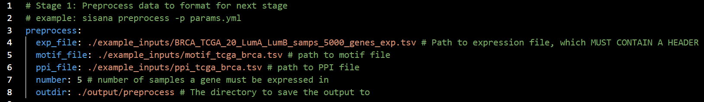

# SiSaNA
Single Sample Network Analysis

SiSaNA is used both before and after creating both PANDA and LIONESS networks from the package netZooPy. SiSaNA first needs to pre-process the data to be ran in PANDA/LIONESS. SiSaNA takes the LIONESS output, processes it to be analyzed downstream, and then calculates in- and out-degree for each of the reconstructed networks. Additionally, it can compare the expression/degree between groups of interest, including performing statistical tests, visualizing the results (volcano plots, boxplots, violin plots, and heatmaps), and compare the survival between groups.

**Note: The steps below are for the basic use of SiSaNA. Additional functionalities are still under development.**

## Requirements
 - python v3.9.19 (see installation steps for creating a conda environment with this specific Python version). SiSaNA should work with versions of Python 3.9.0 or greater, but as it has been written and tested on this version, we will use 3.9.19.
   
## Installation can be performed by running the following steps

1. Create a conda virtual environment with python version 3.9.19. 
```
conda create --prefix </path/to/env-name> python=3.9.19
```

2. Enter the conda environment
```
conda activate </path/to/env-name>
```

3. Install SiSaNA via the pip package installer
```
pip3 install sisana
```

4. Create a directory for the analysis and move into the analysis directory
```
mkdir sisana
cd sisana
```

## Pipeline overview 


## Example input files
Example input files can be obtained using the command
```
sisana -e
```
These files will be copied to a new directory in the current working directory, called "example_inputs". One of these example files is the params.yml file, which can be used as a template and edited for your own data (see next section). Each user-defined parameter in the params.yml file is documented with a comment to explain the function of the parameter. The comments do not need to be removed prior to running SiSaNA. The files in this example_inputs directory can be used in the commands listed down below.

## Viewing help documentation on SiSaNA
To view help documentation on which subcommands are available, the following can be used:
```
sisana -h
```

For further information on these subcommands, simply put the name of the subcommand before the `-h`
```
sisana <subcommand> -h
```

## Setting up your params.yml file
The most important thing to get right in order to correctly run SiSaNA is the structure of your params.yml file. SiSaNA comes with a params.yml file that is annotated to explain the function of each argument. The params.yml file is separated into 'chunks' that reflect the same subcommands available in SiSaNA on the command line. For each step of SiSaNA, you will need to use the correct subcommand, as well as have the parameters set up in the params.yml file.

In the below example, the user is running the "preprocess" step of SiSaNA. They have specified the paths to the input files as well as the value for the number of samples a gene must be expressed in (in their case, 5), along with the path to the output directory in which to store their results.


## Pre-processing of data
The "preprocess" subcommand is the first stage of SiSaNA, where it preprocess the input data to get it in a format that the PANDA and LIONESS algorithms can handle. This will likely involve the removal of genes or transcription factors that are not consistent across files. Information regarding the removal of these factors is given at the end of the preprocessing step.

#### Example command
```
sisana preprocess ./example_inputs/params.yml
```

#### Outputs
Three files, one for each of the three filtered input files. 
<br />
<br />


## Reconstruct and analyze the network
This second SiSaNA stage, "generate", uses the PANDA and LIONESS algorithms of netZooPy to reconstruct gene regulatory networks. Documentation for netZooPy can be found at https://github.com/netZoo/netZooPy/tree/master. It then performs basic analyses of these networks by calculating in-degree of genes (also called gene targeting scores) and out-degree of transcription factors (TFs).

#### Example command
```
sisana generate ./example_inputs/params.yml
```

#### Outputs
1. lioness.npy, which contains all calculated edges for each sample
2. lioness.pickle, which is the same thing, just serialized to make reading into python quicker
3. A file containing the calculated indegree and another file with the outdegree of each gene and transcription factor, respectively.
<br />


## Comparing two experimental groups
The next stage in SiSaNA, "compare", is used to find out how groups differ between each other. SiSaNA offers multiple ways to do this comparison, including t-tests (and Mann-Whitney tests), paired t-tests (and Wilcoxon paired t-tests), survival analysis (typically used for cancer data), and gene set enrichment analysis (GSEA).

To compare the in- and out-degrees between two treatment groups, one can use either a Student's t-test (parametric) or a Mann-Whitney (non-parametric) test. Or for paired samples, one can use either a paired t-test or Wilcoxon signed-rank test, respectively.

#### Example commands
To compare the values between two groups in order to identify differentially expressed genes are differential degrees, you can use the following command:
```
sisana compare means ./example_inputs/params.yml
```

For performing survival analyses, you can use a command like this:
```
sisana compare survival ./example_inputs/params.yml
```
<br />


## Perform gene set enrichment analysis (GSEA) between two groups 
"sisana gsea" is used to perform gene set enrichment analysis (GSEA) to identify pathways that are differentially regulated based on the gene targeting scores. It uses the ranks of genes found in the previous step (sisana compare means) as input.

#### Example commands
```
sisana gsea ./example_inputs/params.yml
```
<br />


## Visualization of results
The final stage of SiSaNA, "visualize" allows you to visualize the results of your analysis on publication-ready figures. There are multiple types of visualization you can perform, including generating volcano plots...
```
sisana visualize volcano ./example_inputs/params.yml
```

...making boxplots or violin plots of expression/degrees...
```
sisana visualize quantity ./example_inputs/params.yml
```

...and creating heatmaps
```
sisana visualize heatmap ./example_inputs/params.yml
```
